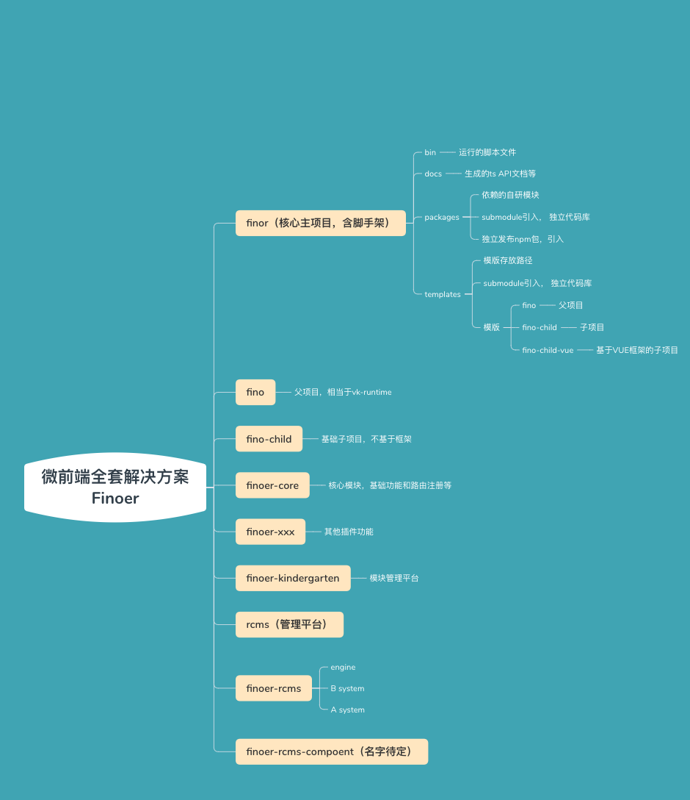

# finoer

The micro front framework tools

## 如何进行开发

> 安装依赖

```powershell
npm install
```


> 开发已经存在模版

- 在根目录下的tsconfing.json中的reference字段中确定需要监控的依赖包

  ```json
  // tsconfing.json
  {
    "references": [
        { "path": "./packages/finoer-core" }
     ]
  }
  ```

- 运行启动命令

  ```shell
  # 开发base模版
  npm run template:base
  # 其他模版项目, 在package.json中添加命令
  npm run template:other
  ```

> 开发package包

- 直接npm run dev <package名称>

  ```shell
  # 启动
  npm run dev finoer-core
  ```

- 打包 npm run build <package名称>

  ```shell
  # 打包
  npm run build finoer-core
  ```

- 生成文档npm run docs <package名称>

  ```shell
  # 打包
  npm run docs finoer-core
  ```

> 添加新的依赖包

1. 克隆/创建新的子模块

   ```powershell
   # 进入packages
   cd packages
   # 添加子模块
   git submodule add https://github.com/finoer/package-startup.git
   # 返回根目录
   cd ..
   ```

2. 根目录下tsconfig添加reference项目

   ```powershell
   {
       "compilerOptions": {
           // ...
       },
       "references": [
           {
               "path": "./packages/startup"
           }
       ]
   }
   ```

3. 运行启动命令

   ```powershell
   npm run template:<project>
   ```

4. 常见问题

   1. 没有监听到子模块的改变

      - 检查根项目下`tsconfig`下面reference是否已经包含了子模块

      - 检查子模块`package.json`入口是否正确

        ```
        {
        	"main": "dist/index.js",
        	"types": "dist/index.d.ts"
        }
        ```

      - 检查子模块的`tsconfig`文件如下属性是否正确

        ```json
         {
         		"compilerOptions": {
              "composite": true,
              "outDir": "./dist/", // 指定输出目录
              "baseUrl": "./src",
            }
         }
        ```

      


### 项目简介

....


### 项目目录

```js
core
├─templates // 微前端项目模版
|     ├─fino-child-vue // vue子项目模版
|     ├─fino-child // 子项目模版
|     ├─fino // 基座模版
├─src
|  └index.ts
├─scripts
|    ├─build.js
|    ├─dev.js
|    ├─docs.js
|    └utils.js
├─packages  // 项目依赖npm包
|    ├─finoer-core // 微前端框架主npm包
|    ├─finoer-component-vue // 子项目npm包

```


### 安装依赖

给package下面的npm包安装依赖

```
# npm run dev <包名>
npm run init finore-core 
# 或者
npm run init finoer-component-vue
```


### 启动命令

**运行packages下面的npm包**

```shell
# npm run dev <包名>
npm run dev finore-core 
# 或者
npm run dev finoer-component-vue
```


### 编译命令

```shell
# npm run build <包名>
npm run build finore-core 
# 或者
npm run build finoer-component-vue
```


### 生成文档

给package下的npm包生成文档

```
# npm run doc <包名>
npm run doc finore-core 
# 或者
npm run doc finoer-component-vue
```



## How to Run

```bash

git clone
git submodule update --init --recursive

```
